# Wagtail CRX Snipcart Storefront

This project integrates Wagtail CRX and Snipcart. Allowing individuals to get a robust e-commerce store off the ground quickly.

## Technology Stack
- Wagtail CRX
- Bootstrap 5
- PostgreSQL
- JavaScript
- Wagtail
- Python
- Django
- HTML
- Ngrok
- CSS

## Integrated Version Status

|                        |                      |
|------------------------|----------------------|
| Wagtail CRX         | 1.0 |
| Snipcart                  | 3.0 |

## Why did I decide to integrate Wagtail CRX and Snipcart?
I decided to utilize the following three technologies because of the following reasons in no specific order:
- Well maintained
- Well documented
- Expedites development time
- Equips end users with advanced tools from inception

### Main Tech Stack Summaries
#### Wagtail CMS
> Wagtail is an open source content management system built on Django, with a strong community and commercial support. It's focused on user experience, and offers precise control for designers and developers.

#### Wagtail CRX
> CRX, formerly known as CodeRed CMS, provides a large set of enhancements and pre-built components for Wagtail which are ready to use out-of-the box! This saves development time and avoids "re-inventing the wheel" by providing features commonly needed by websites.

#### Snipcart
> It's simple, fully customizeable, well documented, regularly maintained and updated, as well as includes a robust e-commerce dashboard.

---

## Quick start

##### Create a Wagtail CRX Project
1. Run `pip install coderedcms`

2. Run `coderedcms start mysite --sitename "My Company Inc." --domain www.example.com`

    *Note: `--sitename` and `--domain` are optional to pre-populate settings of your website.*

3. Enter the project `cd mysite/`

##### The Secret Spice

4. Copy and paste the models from this repository at `wagtail_crx_snipcart_storefront/website/models.py` into your projects models.py file.

5. Copy and paste the base.html file located in `wagtail_crx_snipcart_storefront/website/templates/coderedcms/pages` of this repository into your projects base.py file.

6. Create a [Snipcart](https://snipcart.com/) account and get your Public Test API Key.

7. Paste your Public Test API Key directly below the "Insert Public API Test Key on the line below." comment within base.html.
    - Once your e-commerce store is ready to go live you will replace the Public API Test Key with the Public Live API Key provided by Snipcart.

8. Create a products_page.html file in `project_name/website/templates/coderedcms/pages`

9. Copy and paste products_page.html from this repository located at `wagtail_crx_snipcart_storefront/website/templates/coderedcms/pages` into your projects product_page.html file.

10.  Create a products_index_page.html file in `project_name/website/templates/coderedcms/pages`

11. Copy and paste products_index_page.html from this repository located at `wagtail_crx_snipcart_storefront/website/templates/coderedcms/pages` into your projects product_index_page.html file.  

12. Create a snippets folder in `project_name/website/templates/coderedcms`

13. Create a navbar.html file in `project_name/website/templates/coderedcms/snippets`

14. Copy and paste navbar.html from this repository located at `wagtail_crx_snipcart_storefront/website/templates/coderedcms/snippets` into your projects navbar.html file.

##### Implement Secret Spice

15. Run `python manage.py migrate` to create the core models.
    - Wagtail CRX by default utilizes SQLite. Set up your preffered database solution now to save yourself the headache of a database migration.
        - If you choose PostgreSQL feel free to leverage [my tutorial](https://www.justicedouglas.com/blog/creating-wagtail-crx-project-with-postgresql/).

16. Run `python manage.py createsuperuser` to create the initial admin user.

17. Run `python manage.py runserver` to launch the development server, and go to `http://localhost:8000` in your browser, or `http://localhost:8000/admin/` to log in with your admin account.
    - At this point you can do everything but perform Snipcart test transactions which are required to populate your product data into your Snipcart accounts dashboard.

##### The Miracle that is ngrok

18. Install [ngrok](https://ngrok.com/), and add ngrok authtoken.
    - [Official Snipcart ngrok Documentation](https://snipcart.com/blog/develop-a-snipcart-powered-website-locally-using-ngrok)
    - Snipcart is unable to communicate to your local machine, thus local development is impossible without making your local development server available to Snipcart. Ngrok solves this pain point.
    - If utilizing Mac OS I suggest installing ngrok via the Homebrew option.

19. In a separate terminal run 'ngrok http <localhost number>'.
    - Example: ngrok http 8080

20. If succesful you will see an ngrok session status appear. Copy the forwarding url.
    - Example: https://<string-of-random-numbers-and-letters>.ngrok.io

21. Navigate to your Snipcart dashboard, open account options (click on the upper right hand corner human icon), click on "Domains & URLS".

22. In the Domain field paste the ngrok forwarding url. 

23. In the protocol field select 'https'.

24. Press the save button on the "Domains & URLS" page. 

25. Paste your ngrok forwarding url into your search bar and hit enter. It should take you to your project in a tab with an ngrok tunnel capable of making transactions with Snipcart. 

26. In a separate tab, paste your local host url that is running the project - Example: http://localhost:8000
    - IMPORTANT NOTE: You must have two separate tabs open, and use them in unison. One for transactions and the other for admin dashboard use.
        - https://<string-of-random-numbers-and-letters>.ngrok.io --> Can make Snipcart transactions. Can't access admin dashboard.
        - http://localhost:8000 --> Can't make Snipcart transactions. Can access admin dashboard.

##### The Final Stretch

27. In the admin capable tab create a test product via signing into the admin, creating a Products Landing Page. After creation navigate to your newly created Products Landing Page in the admin and click create child page. Fill out all required product information, and press publish when done.

28. In the transaction capable tab add the product to your cart and attempt check out.

29. Congratulations, you have succesfully made a test transaction! 🎉 
    - You will be able to see your test transaction in your Snipcart dashbaord. 

See the [Wagtail CRX docs](https://docs.coderedcorp.com/wagtail-crx/) and [Snipcart docs](https://docs.snipcart.com/v3/) for questions regarding customization and development.

---

#### Quick Start Disclaimer
1. It is your responsibility to properly manage your Snipcart provided APIs.
2. It is your responsibility to read all pertinent documentation not covered here.
3. Upon completion of the quickstart you should have a fully functional non-live project capable of making test transactions.
4. It is your responsibility to ensure you have chosen and properly configured a database that scales proportionally to your ambitions. 
5. It is your responsibility to protect sensitive data pertinent to your project, such as database environmental variables and other sensitive information before deploying your project to production.

## Documentation links

* To customize the content, design, and features of the site see
  [Wagtail CRX](https://docs.coderedcorp.com/wagtail-crx/).

* For deeper customization of backend code see
  [Wagtail](http://docs.wagtail.io/) and
  [Django](https://docs.djangoproject.com/).

* For HTML template design see [Bootstrap](https://getbootstrap.com/).

* For Snipcart customizations and utilization see [Snipcart](https://docs.snipcart.com/v3/)

---

## Project Screenshots
##### Disclaimer
Due to the passionately long nature of the example customer's email the email text is running into the billing address text in screenshots seven and eight. Under normal email length circumstances provided by test users not hellbent on [pressuring Tacobell to bring back the XXL Grilled Stuft Burrito](https://www.change.org/p/taco-bell-bring-back-the-xxl-grilled-stuffed-burrito) this text conflict would not occur.
1. 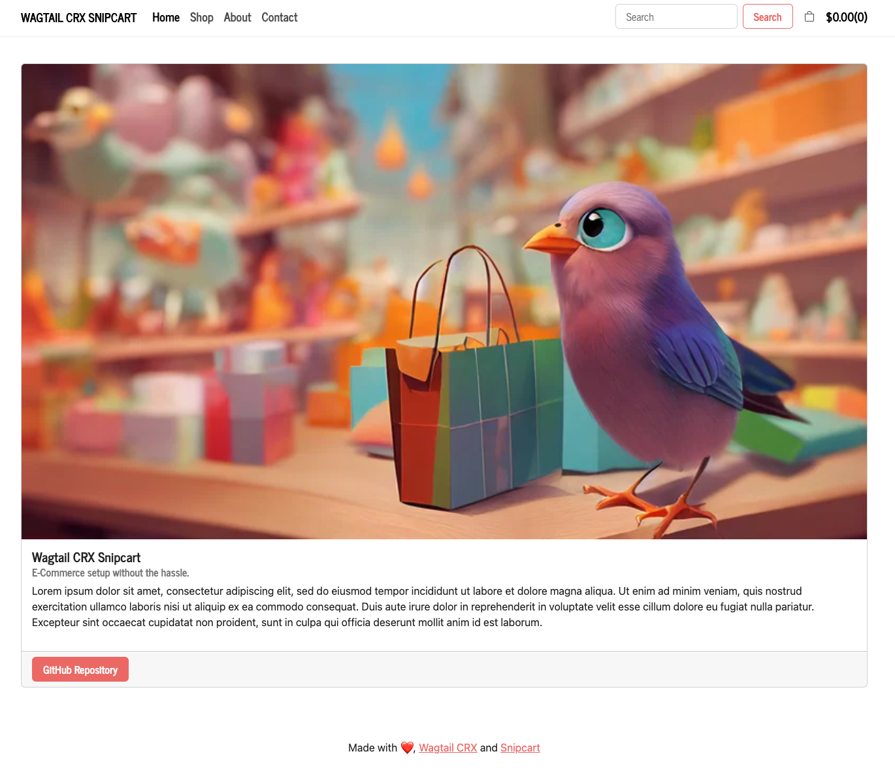

2. 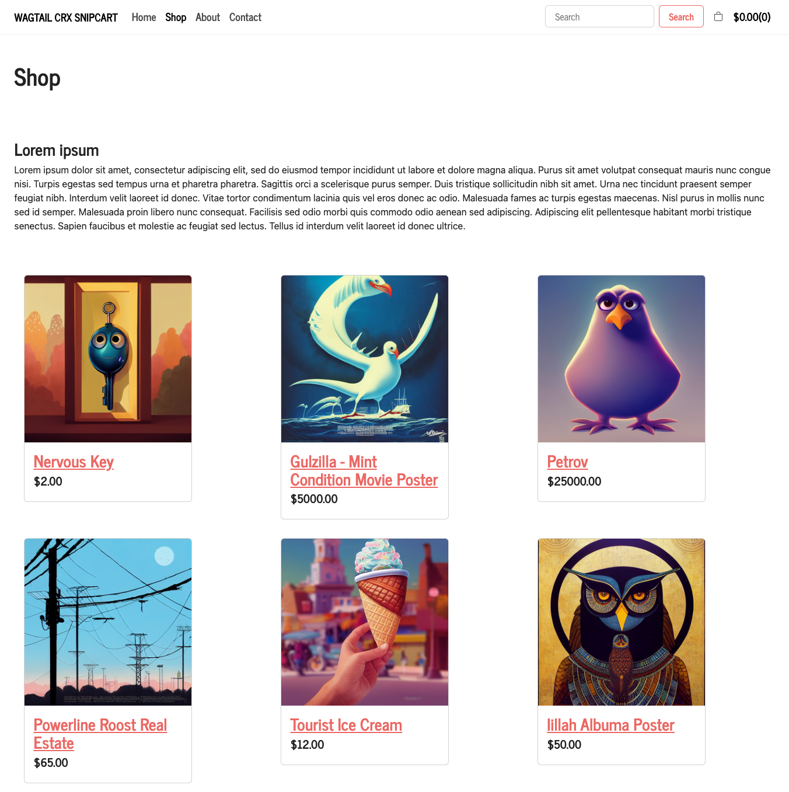
3. 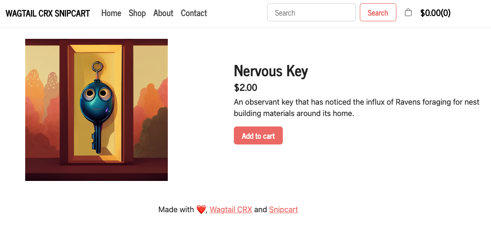
4. 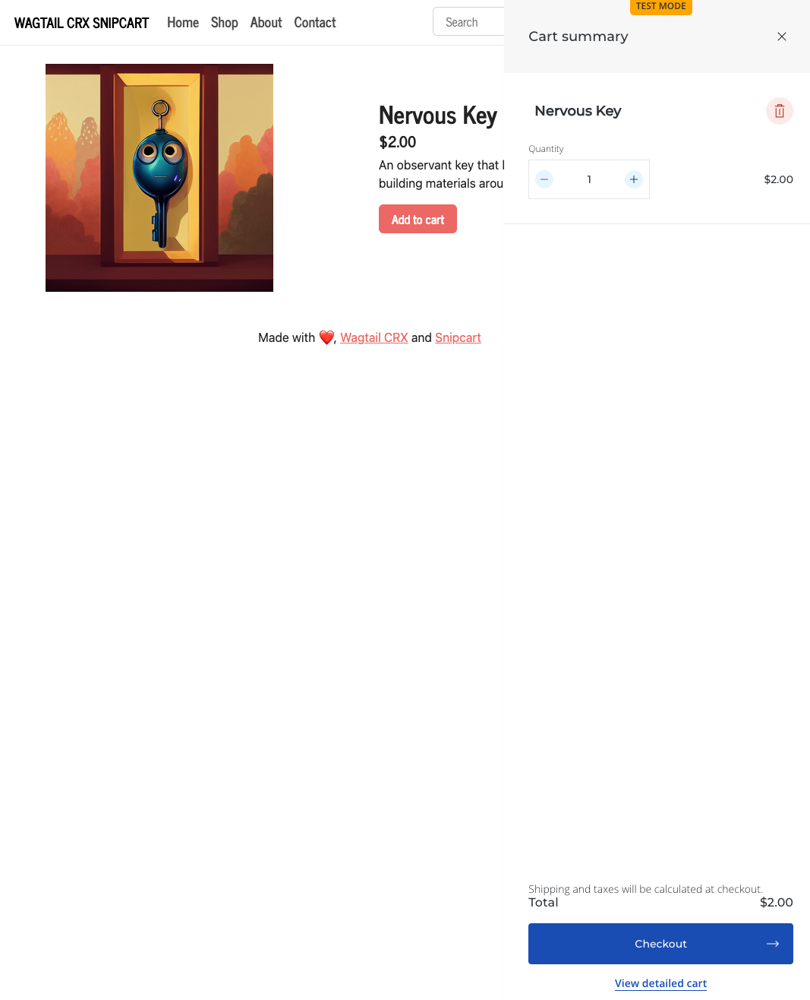
5. 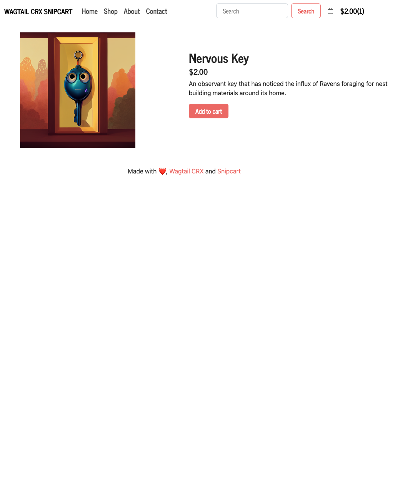
6. 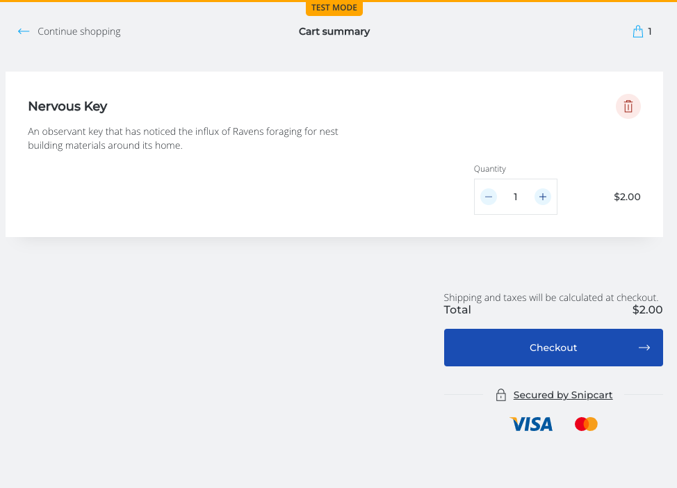
7. 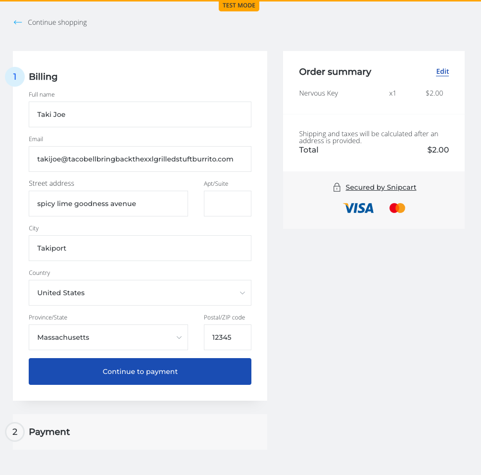
8. 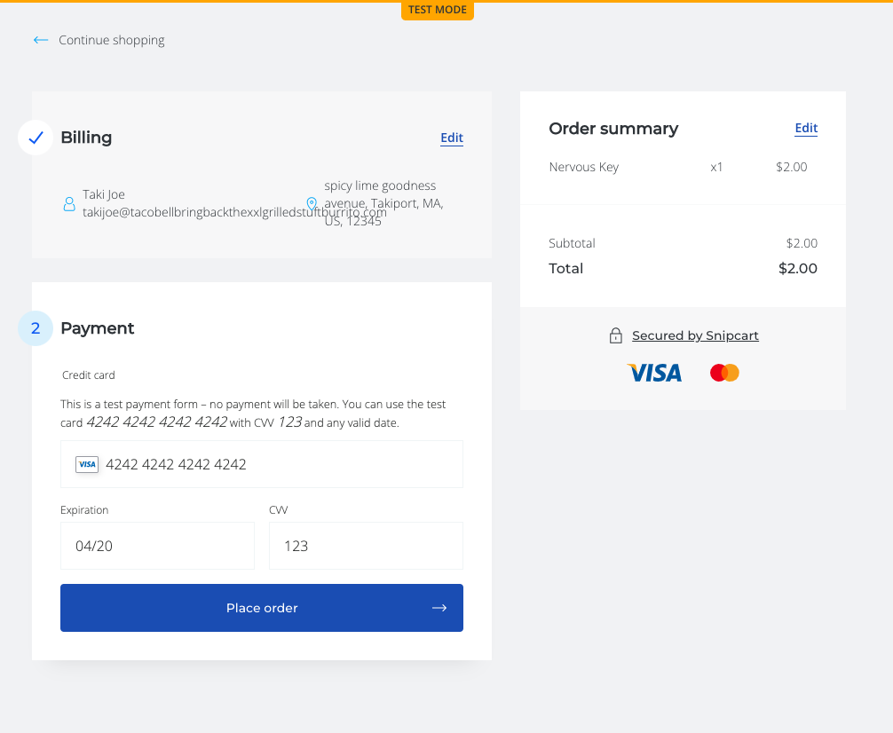
9. 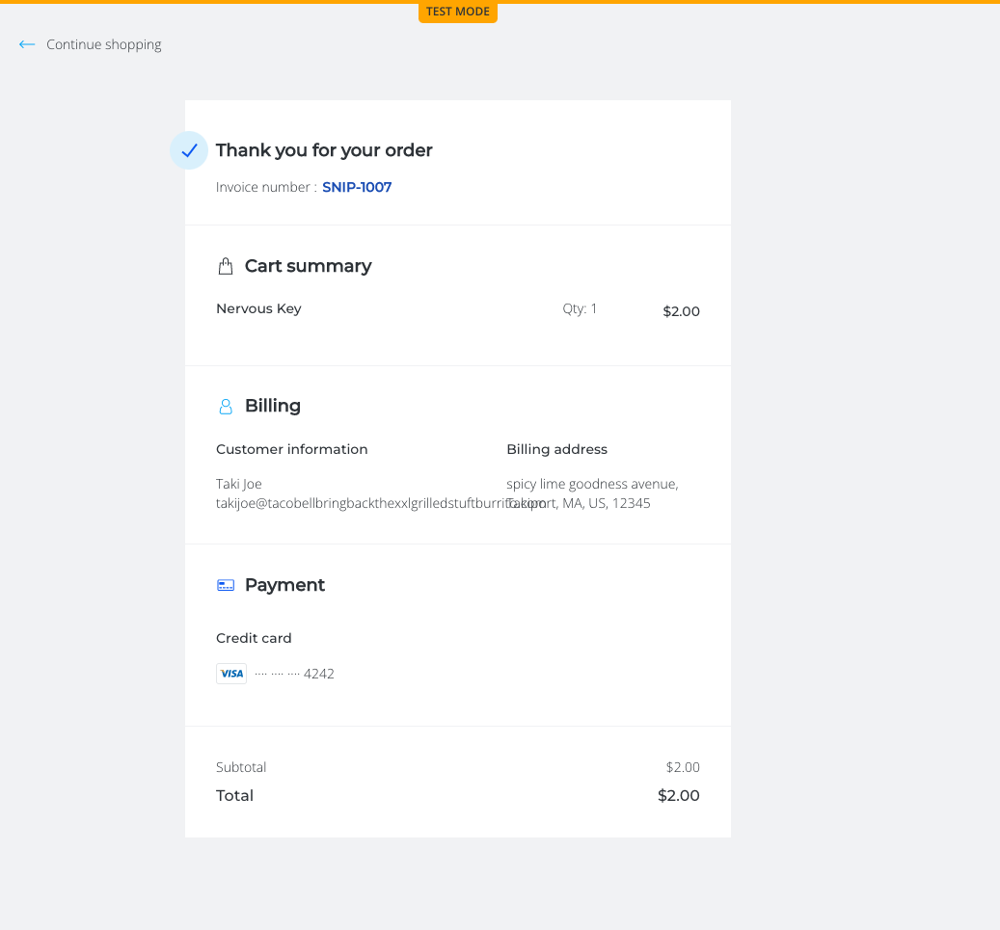
10. 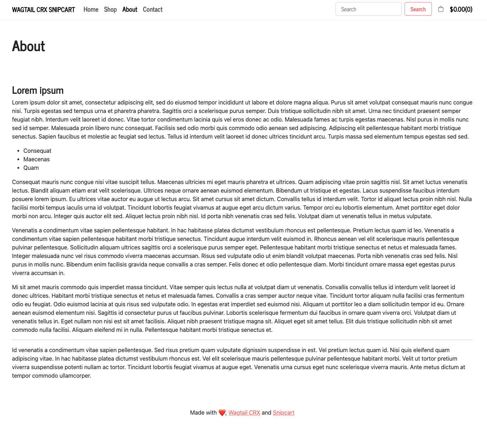
11. 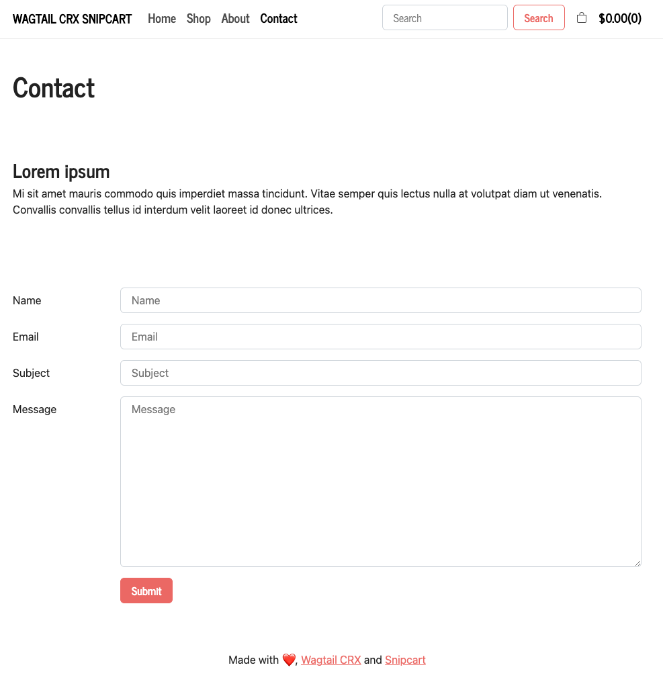

###### Note
I decided to not share screenshots of the admin as it should be straightforward with a combination of the provided official documentation as well as this README.

## Future Plans
I plan to create a Python Package based off this project to give back to the community that got me into programming. The goal is to make creating a Wagtail based e-commerce store as simple as spinning up a CRX project and pip installing the package.

## Giving Credit

Credit is giving to [CodeRed](https://www.coderedcorp.com/) for developing and maintaining [Wagtail CRX](https://docs.coderedcorp.com/wagtail-crx/), [Paul Wababu](https://github.com/paulwababu) for creating a wondeful [Wagtail and Snipcart integration lesson](https://dev.to/paulwababu/build-an-e-commerce-site-with-wagtail-cms-bootstrap-django-framework-4jdb) I leveraged massively, the [Django](https://www.djangoproject.com/) and [Wagtail](https://wagtail.org/) communities for providing such thorough documentation, and [Stack Overflow](https://stackoverflow.com/) for when I wasn't wise enough to read the documentation.

## Contact

If you're interested in working with me to improve this project and turn it into a pip package feel free to contact me on my [website](https://www.justicedouglas.com/). Alternatively, I would love to hear any questions, comments or feedback you may have.

## Attribution
Files in `wagtail_crx_snipcart_storefront/website/models.py `, `wagtail_crx_snipcart_storefront/website/templates/coderedcms`, `wagtail_crx_snipcart_storefront/mysite/settings/base.py`:
- Were sourced from the Wagtail CRX project at
  https://github.com/coderedcorp/coderedcms.
- Are licensed under the Creative Commons Attribution 3.0 Unported
  license, a copy of which is available at
  https://creativecommons.org/licenses/by/3.0/
- Have been modified from the original sources.

---

Made with ♥ using [Wagtail CRX](https://www.coderedcorp.com/cms/) + [Snipcart](https://snipcart.com/)
